# Chat server 💬

This is an implementation of a chat server, utilizing a microservices-based architecture for handling message exchanges between users.

## Architecture 🛠️

The project consists of three main parts:

1. **Main server**. Written in C++ using the Poco library, it is responsible for for handling messages, managing users, and maintaining network connections.
2. **Proxy server**. Implemented in Node.js, Express, and WebSocket, it acts as a bridge between the client and the main server, allowing the use of WebSockets on the client side.
3. **Client**. Created using the Quasar framework, enabling a user interface that allows interaction with the servers, sending messages, joining, and leaving the chat.

## Features 🚀

- 📥 **Joining the chat**. Users can enter their nickname and join the chat.
- 💬 **Public messages**. Allows sending messages that are visible to everyone in the chat.
- 🕵️‍♀️ **Private messages**. Users can send private messages that are only visible to the sender and the recipient.
- 📤 **Exiting the chat**. Option to leave the chat.

## Installation and running 🔧

### Main server

#### Requirements

- CMake version 3.26 or higher.
- C++ compiler supporting C++23 standard.

#### Build instructions

1. Clone the repository to your local machine:
    ```bash
    git clone https://github.com/Braun-Alex/chat.git
    cd chat/server
    ```
2. Create a build directory and navigate into it:
    ```bash
    mkdir build
    cd build
    ```
3. Run CMake to generate the build files:
    ```bash
    cmake ..
    ```
4. Build the project:
    ```bash
    cmake --build .
    ```
5. After a successful build, run the server:
    ```bash
    ./server
    ```

### Proxy server

Ensure you have Node.js and npm installed. Run the following commands:

```bash
cd chat/middleware
npm install
npm start
```

### Client

Ensure you have Quasar CLI installed. Run the following commands:

```bash
cd chat/client
npm install
quasar dev
```

## Screenshots 📄

<p align="center">
  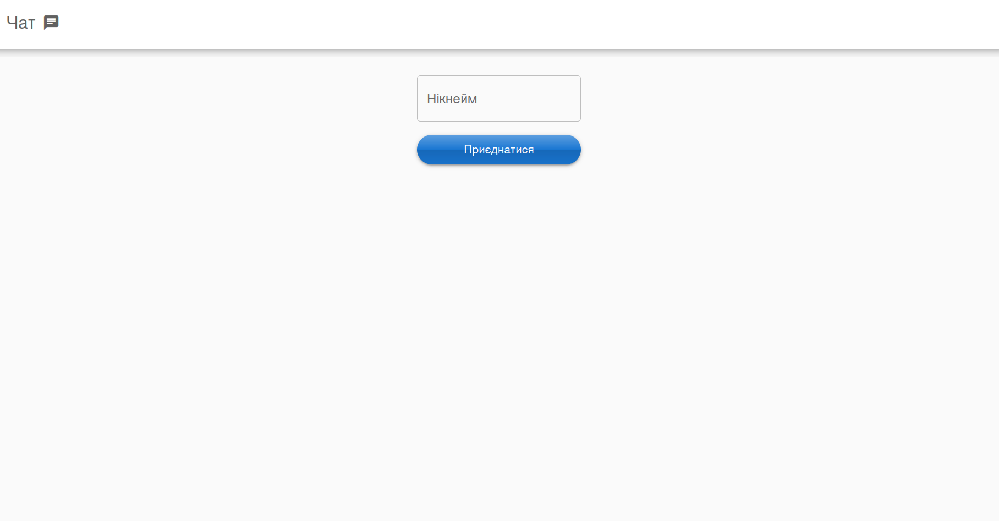
  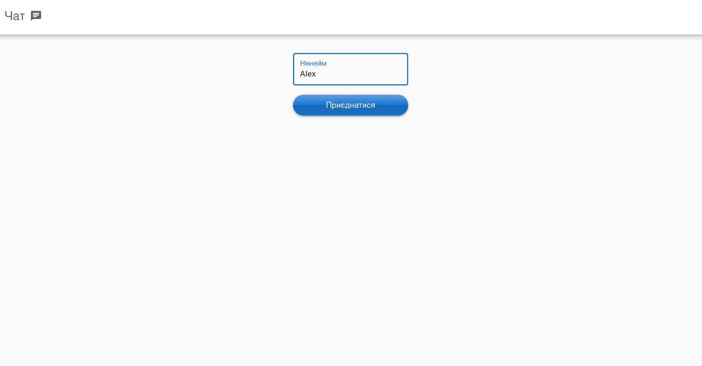
</p>

<p align="center">
  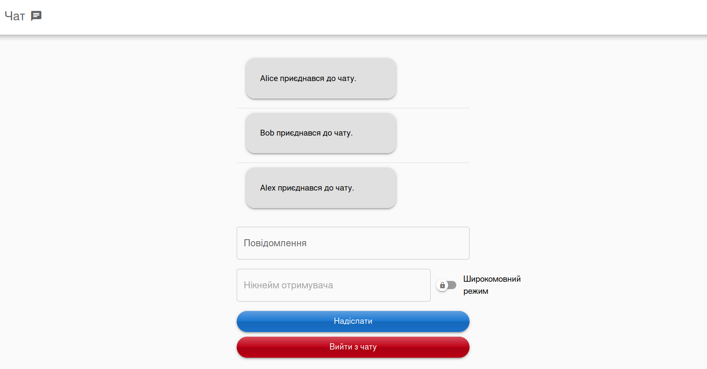
  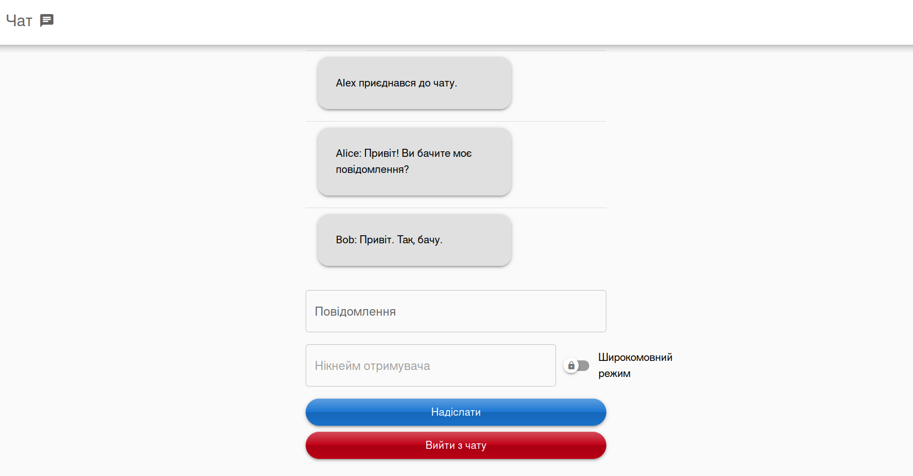
</p>

<p align="center">
  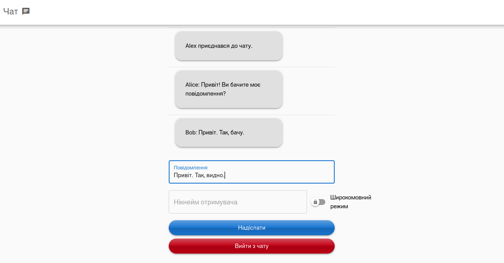
  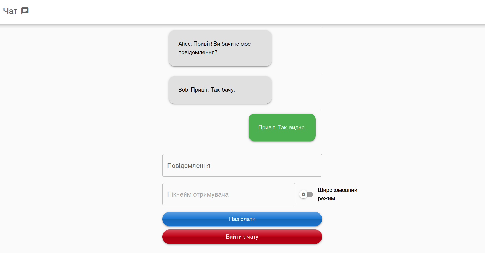
</p>

<p align="center">
  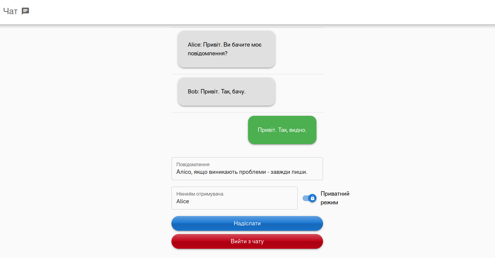
  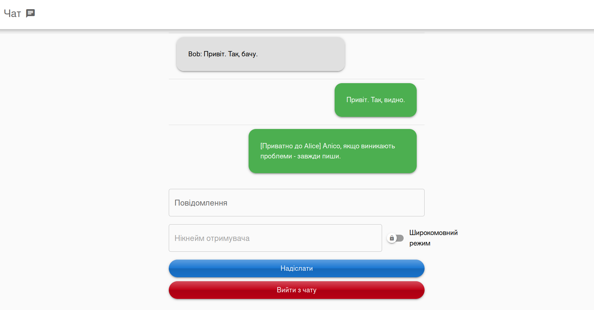
</p>

<p align="center">
  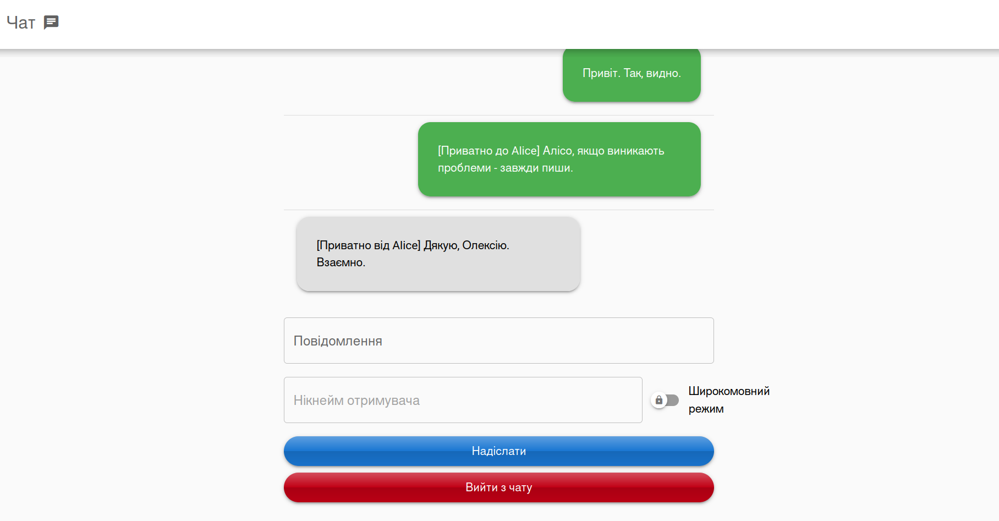
  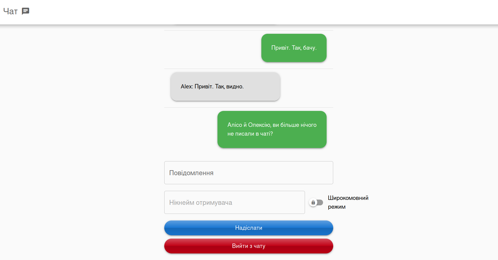
</p>

<p align="center">
  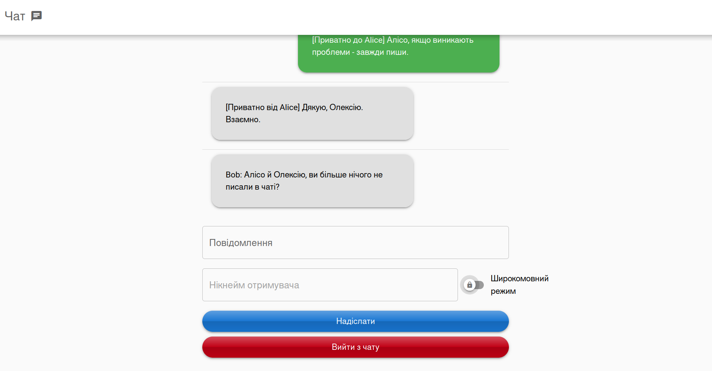
  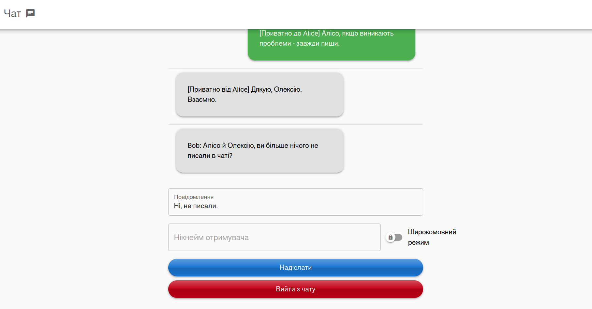
</p>

<p align="center">
  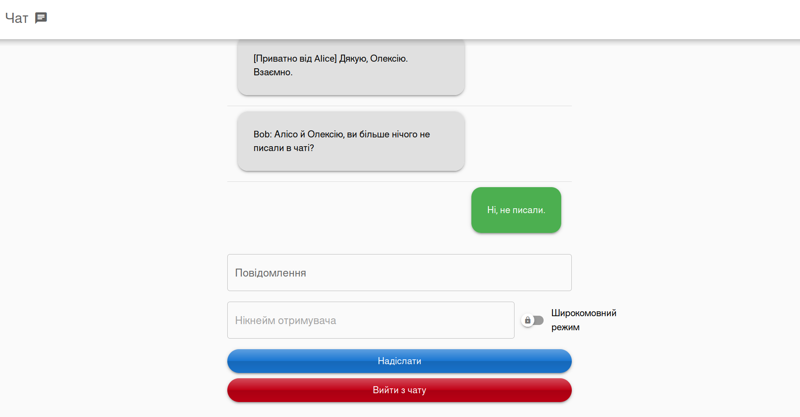
  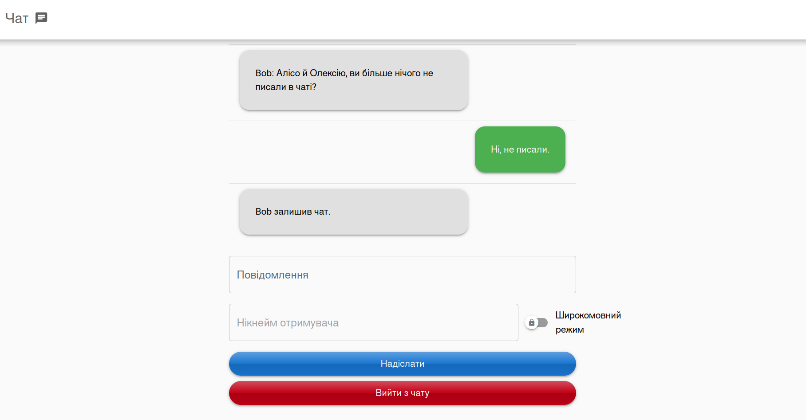
</p>


## Author ✒️

[Alex Braun](https://github.com/Braun-Alex).

## License 📋

This project is licensed under the MIT license - see the LICENSE.md file for details.
